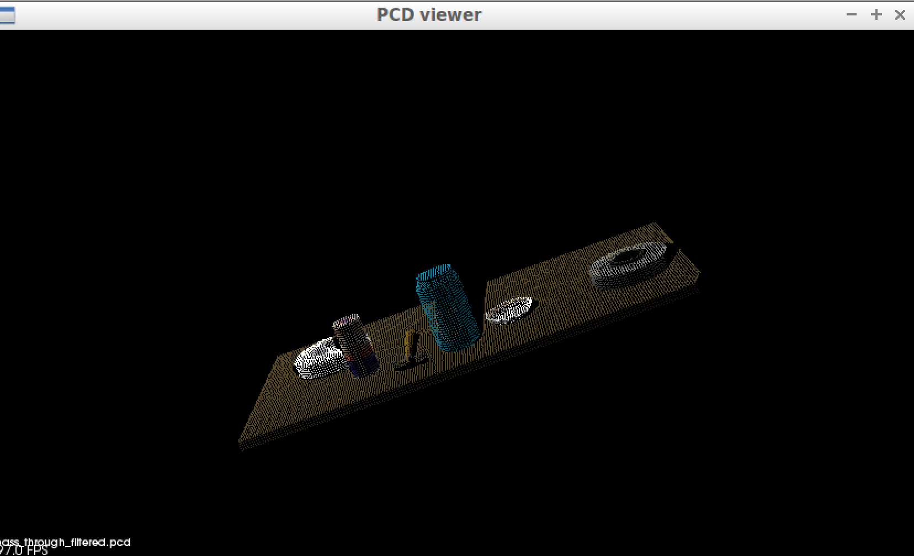

## Project: Perception Pick & Place
### Writeup  by Divya Patel ###

This project allowed us to really get down and dirty with the perception pipeline and figure out how to best understand machine learning as well as work on methods of avoiding collisions and clearing the various maps so that the robot can best pick up the objects. There is a high learning curve for ROS and Gazebo but the extra time allocated to working on this project and pushing through creates oppurtunities to really learn the tools needed to have a successful pick and place.

One of the things I really learned was to correctly set the bashrc file, update certain packages and do not update ubuntu. I had to many system issues and it really helped me learn linux extremely well.

Using a tilda didn't help my situation as the bashrc file didn't really know where to go. so I modified by adding the full path here and it solved many of my problems. I was consistently having many problems and found that this and also an update on the vmware ubuntu caused all of these problems, I also needed to update certain packages and googled endlessly to figure out the cures. I eventually started completely over and simplified my approach to see where the problems where. Turns out I wasn't the only one having these issues so I hope this writeup will help others. 

Besides dividing by 0 because you have an empty cloud this is another error you get if you don't source the bashrc file correctly.

Make sure you source your bashrc file CORRECTLY. 
export GAZEBO_MODEL_PATH=/home/robond/catkin_ws/src/RoboND-Perception-Project/pr2_robot/models:$GAZEBO_MODEL_PATH
export GAZEBO_MODEL_PATH=/home/robond/catkin_ws/src/sensor_stick/models
source /home/robond/catkin_ws/devel/setup.bash

Also do not under any circumstance update the vmware ubuntu using sudo apt-get update, alot of your scripts will not be compatible and it messes with the libraries. You do not need the update. You will need to update the pip install to install the scilearn and also the pcl library. Looks like the pip would need upgrading: wanted to let everyone know to use: the following inside the VM as the normal upgrade line wasn't working. The best way to do that is to use easy upgrade to pip 10.0: 

#### sudo easy_install -U pip ####

If you get the error: cannot resolve publisher host, shutdown your vmware and restart your computer or manually set your IP in the bashrc file.

You may need to update certain packages if you get: 
pip check
launchpadlib 1.10.3 requires testresources, which is not installed.
python-pcl 0.2 has requirement Cython>=0.25.2, but you have cython 0.23.4.

Finally, if you have this issue: ImportError: numpy.core.multiarray failed to import
Use this line: sudo pip install -U numpy 

  I used the pick list files located in the config folder to change the models list in the capture_features script that I ammended in order to train the objects which is located [here](https://github.com/OptimomEngineer/RoboND-Perception-Exercises/blob/master/Exercise-3/sensor_stick/scripts/capture_features.py). 
  The features.py script located [here](https://github.com/OptimomEngineer/RoboND-Perception-Exercises/blob/master/Exercise-3/sensor_stick/src/sensor_stick/features.py) which allowed me to set the histogram settings in order to correctly determine the object. 
  
to train objects first generate features, make sure your list in capture_features.py is correct.
cd ~/catkin_ws
roslaunch sensor_stick training.launch

Run your capture_features.py script.
cd ~/catkin_ws/src/sensor_stick/scripts/
rosrun sensor_stick capture_features.py

Finally train the captured_features using the train_svm.py script. (you will need a training_set.sav file in the same directory you run this script)
rosrun sensor_stick train_svm.py

Here I show you the Exersize 3 objects that I had previously trained. Further in the write up I will show you all the different worlds.

I wrote a ROS node and subscribe to `/pr2/world/points` topic. This topic contains noisy point cloud data that we needed to modify in order to make the data usable for idenfitication and pick up. 

pcl_sub = rospy.Subscriber("/sensor_stick/point_cloud", pc2.PointCloud2, pcl_callback, queue_size =1)

Since this data came in as a ROS pointcloud2, we needed to obtain the pcl data in order to manipulate the data, luckily udacity provided some helper functions to help with this task. This link is located [here](https://github.com/OptimomEngineer/RoboND-Perception-Project/blob/master/pr2_robot/scripts/pcl_helper.py)

Finally we used various kinds of filtering, RANSAC plane fitting isolate the objects of interest from the rest of the scene. 

Here is a passthrough filter example from the exercise objects: 

The additional filtering took some time since at first I had quiet a bit of the table still included in the objects isolation. I wanted created a filter for all three axis' in order to completely identify all the objects. 
This shows a table sliver and then without the sliver for the exercise objects. The same will be shown for the project objects below.

Here is the extra "bar" from the table shown from the projects. I needed to add an additional couple of filters in different axis' in order to compensate for this. You can see the robot is seeing the bar as "biscuits"! 

I was missing an object or including objects I didn't want to until I had the correct filtering conditions that worked to identify all the objects. I also included a k-means euclidean filtering and gave each object a unique color. Udacity's helper file eased the process by including some functions that helped generate random colors.

Finally I located the centriod, though I feel like i could have extended this further to create a centroid from the max, mean and min values, I only developed the centroid from the mean value. I think the robot would have an easier time grasping the objects with a centroid created from mulitple values. 

Each world recognition is shown below and the associated .yaml files are located [here](https://github.com/OptimomEngineer/RoboND-Perception-Project/tree/master/pr2_robot/output)
### World 1:
Confusion Matrix

Identified Objects

### World 2:
Confusion Matrix

Identified Objects

### World 3:
Confusion Matrix

Identified Objects

Then of course here is the clustered and filtered picture as I promised.

100% of all items were identified using the code.

You would need to change the pick_place_project.launch file with the correct yaml file and world file numbers. In the future I would add a prompt to the user to enter this and automatically have this set up with the command line.

To test the trained objects with the project like I did, you can go into the correct directory:
cd ~/catkin_ws
then run: 
roslaunch pr2_robot pick_place_project.launch

then start the script: 
go into this directory: 
cd ~/catkin_ws/src/RoboND-Perception-Project/pr2_robot/scripts/

rosrun pr2_robot project_template.py

The program will continue until all the objects have been placed into the bin.

I rotated the robot with a function I created using the simple mover coding we had learnt earlier in the course. I allowed a general turn of 1.5 radians that and then when the robot reached a sufficient joint angle, I published the joint angle I received from the jointstate value that I subscribed to in the function using this: pr2_base_mover_pub.publish(joint_state.position[0]). Then of course I rotated back to original state in order to complete the challenge

I moved on to complete the Pick and Place extra challenge. I published a pointcloud to the /pr2/3d_map/points topic by ammended each pointcloud for each object that was not going to be picked up and then ammended the table to the collision map. After the object was picked up I then cleared the collision map using some octomap commands that I learned from a ROS book.(See code for details)

I created a ROS Client for the “pick_place_routine” rosservice with the correct arguments and was able to get some of the objects into the boxes. unfortunately my robot liked to throw things around and I wasn't able to get a picture with all the objects in the boxes, however the correct arm performed to pick place each time and displayed the correct trajectories using the correct collision map.

I then looked for that bigger challenge and loaded up the `challenge.world` scenario. Here are my results. 

I would want to improve the placement of the objects and also work on the pr2_mover code in the next round as my robot was consistently throwing the objects rather than placing in bin. Finicky guy!!! Another improvement I would like to make is the timing of how quickly the robot performs. Both of these things are not in the scope of this project, but just something I would like to do.

